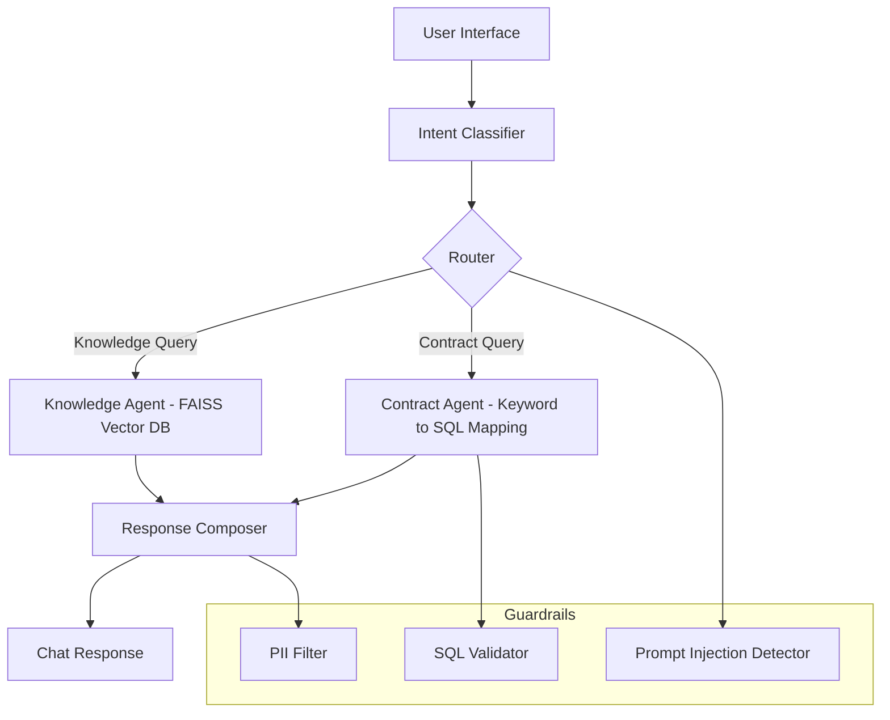
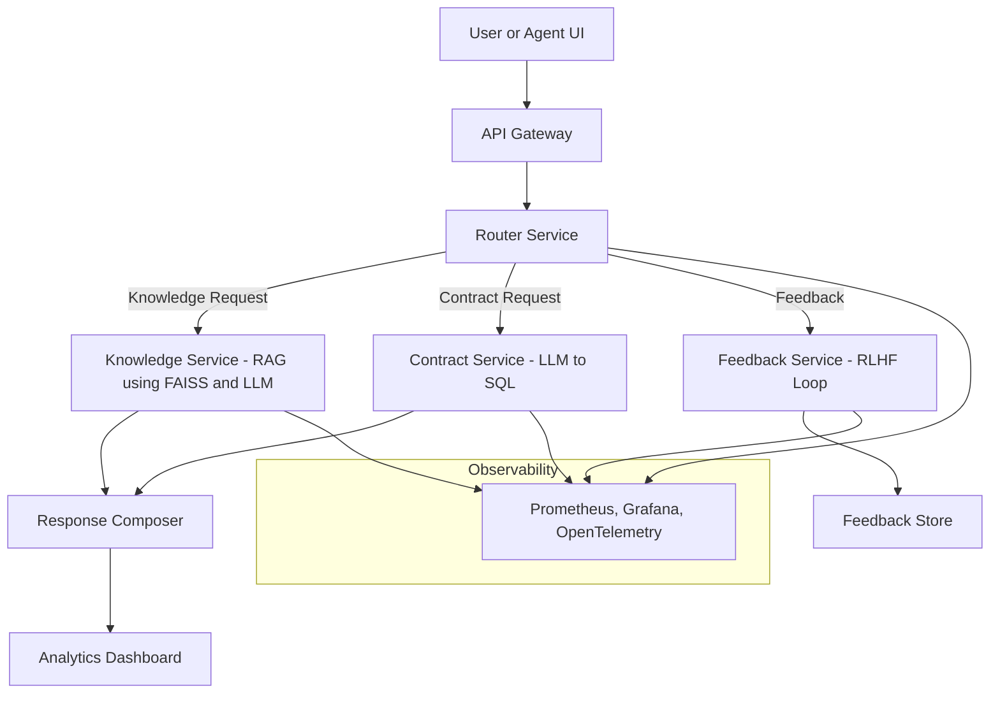

# Multi-Intent AI Chatbot Assistant

### Overview
The Multi-Intent AI Chatbot Assistant helps service and analytics teams answer both product-related and account-specific questions quickly, accurately, and securely.

The project evolves through three practical stages:

1. **Phase 1 - Pre-LLM (Deterministic Pilot)**  
   An offline, rule-based chatbot that uses FAISS for document search and keyword-to-SQL mapping for structured data.

2. **Phase 2 - Full LLM (Production)**  
   A retrieval-augmented generation (RAG) platform with microservices, continuous feedback, and enterprise observability.

3. **Phase 3 - Scaling and Orchestration (Kubernetes)**  
   Expands Phase 2 into a self-healing, auto-scaling platform that runs reliably across clusters and regions.

---

## Phase 1 - Pre-LLM Pilot (4-6 weeks)

**Goal**  
Prove the concept with an explainable system that runs entirely offline.

**Core Stack**
- FastAPI backend  
- FAISS vector search with SentenceTransformers embeddings  
- Keyword-based SQL generation with validation guardrails  
- SQLite mock contract database  
- Docker for deployment and CI/CD

**What It Does**
1. Classifies intent (knowledge, contract, or unknown).  
2. Retrieves answers from local docs or SQL queries.  
3. Applies guardrails for SQL safety, PII protection, and prompt injection defense.  

**Key Metrics**

| Objective | Metric | Target | Owner |
|------------|---------|---------|--------|
| Intent Accuracy | ≥ 80 % | Data Science |
| Response Latency | < 3 s | Engineering |
| SQL Validation | 100 % Safe | Security |
| Positive Feedback | ≥ 70 % | CX Team |

**Outcome**  
A reliable, low-cost prototype that proves feasibility and governance readiness before involving any LLMs.

---

## Phase 2 - Full LLM Production (3-6 months)

**Goal**  
Scale the pilot into a production-grade platform that blends LLMs with vector retrieval and structured data.

**Core Stack**
- FastAPI microservices on Kubernetes or ECS  
- GPT-4 Turbo integrated with FAISS (RAG pattern)  
- Natural language to SQL via LLM  
- RLHF feedback and retraining loop  
- Prometheus, Grafana, and OpenTelemetry for monitoring  
- Helm and multi-stage CI/CD pipelines  
- Role-based access control and security guardrails

**What It Adds**
- Conversational context and flexible phrasing through LLMs  
- Continuous improvement through RLHF feedback  
- Cloud-native deployment and observability

**Key Metrics**

| Objective | Metric | Target | Owner |
|------------|---------|---------|--------|
| Reliability | Uptime ≥ 99.9 % | DevOps |
| Latency | P95 < 2 s (including LLM) | Engineering |
| Governance | Automated Drift Detection | Data Ops |
| Cost Efficiency | < $0.05 per query | Finance |
| Model Updates | Weekly Retraining | Data Science |

**Outcome**  
An enterprise-ready AI assistant that combines structured data, documentation, and natural conversation — with full transparency and traceability.

---

## Phase 3 - Scaling and Orchestration (6-12 months)

**Goal**  
Turn the Phase 2 system into a cloud-native, self-healing platform that scales automatically with demand.

**Core Stack Enhancements**
- Kubernetes (GKE, EKS, or AKS) for orchestration  
- Helm for automated deployments  
- Horizontal Pod Autoscaler (HPA) for scaling  
- Ingress and Load Balancer for global routing  
- GitOps (Argo CD or Flux) for continuous rollout  
- Unified observability with Prometheus and Grafana  

**What It Delivers**
1. Multi-node Kubernetes cluster with containerized services.  
2. Rolling updates and zero-downtime deployments.  
3. Centralized logs, metrics, and health monitoring.  
4. Elastic scaling to handle changing workloads.

**Key Metrics**

| Objective | Metric | Target | Owner |
|------------|---------|---------|--------|
| Horizontal Scaling | Pods expand under load in under 1 min | DevOps |
| Reliability | SLA ≥ 99.95 % | DevOps |
| Resource Efficiency | Node utilization ≥ 80 % | Finance |
| Deployment Speed | 100 % Zero-Downtime Rollouts | Platform Team |

**Outcome**  
A global, cloud-native chatbot platform that scales intelligently and recovers automatically — ready for enterprise load and future model integrations.

<!-- 
[PHASE 3 EXPANSION NOTES]  
- Helm templates: ./phase3_scaling/helm/  
- Kubernetes YAML: ./phase3_scaling/deployment.yaml  
- Observability dashboards: ./phase3_scaling/observability/  
- GitOps pipelines: ./phase3_scaling/ci_cd/  
-->

---

### Architecture Overview

#### Phase 1 - Pre-LLM Pilot


#### Phase 2 - LLM Production


---

### Repository Structure
```
multi-intent-ai-chatbot-assistant/
├── phase1_pilot/
│   ├── app/
│   ├── guardrails/
│   ├── data/
│   ├── evals/
│   ├── Dockerfile
│   └── ci_cd.yaml
│
├── phase2_production/
│   ├── services/
│   ├── helm/
│   ├── observability/
│   ├── evals/
│   ├── Dockerfile
│   ├── .env.example
│   └── ci_cd_pipeline.yaml
│
└── phase3_scaling/        # To be added for Kubernetes and GitOps
```

---

### Contact
Developed by **James W. Niu**  
Questions: **jameswnarch@gmail.com**

---

### License
MIT License
