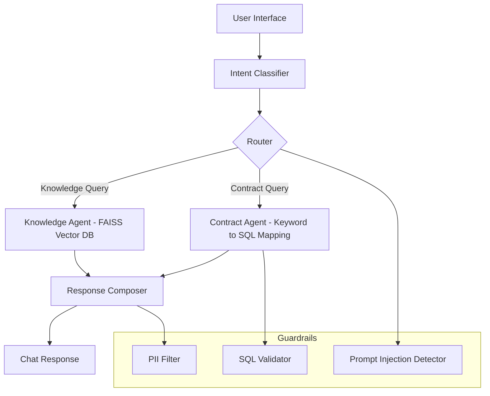

# Multi-Intent AI Chatbot Assistant

### Executive Summary
The Multi-Intent AI Chatbot Assistant helps service and analytics teams answer both product-related and account-specific questions with accuracy, compliance, and scalability.

It evolves in three clear stages:

1. **Phase 1 - Pre-LLM (Deterministic Pilot)**  
   A rule-based, offline system using FAISS vector retrieval and keyword-to-SQL mapping.

2. **Phase 2 - Full LLM (Production Deployment)**  
   A retrieval-augmented generation (RAG) platform with microservices, continuous learning, and observability.

3. **Phase 3 - Scaling & Orchestration (Kubernetes)**  
   Converts Phase 2 containers into a fully orchestrated, auto-scaling platform.

---

## Phase 1 - Pre-LLM Pilot (4-6 weeks)

**Purpose**  
Prove value with a lightweight, explainable system that runs fully offline.

**Core Stack**  
- FastAPI backend  
- FAISS vector database + SentenceTransformers embeddings  
- Keyword to SQL mapping with guardrails  
- SQLite mock contract database  
- Docker container and CI/CD pipeline

**Deliverable**  
A working chatbot that:  
1. Classifies intent ("knowledge" vs. "contract" vs. "unknown").  
2. Retrieves answers from local documentation or SQL.  
3. Applies guardrails for SQL safety, PII filtering, and prompt-injection defense.  

**Success Metrics**

| Objective | Metric | Target | Owner |
|------------|---------|---------|--------|
| Intent Classification | Accuracy | ≥ 80 % | Data Science |
| Latency | Average response time | < 3 s | Engineering |
| SQL Safety | Validator Pass Rate | 100 % | IT / Security |
| User Feedback | Positive Responses | ≥ 70 % | CX Team |

**Outcome**  
A deterministic, low-cost proof of concept demonstrating data governance and functional reliability.

---

## Phase 2 - Full LLM Production (3-6 months)

**Purpose**  
Scale the pilot into an enterprise-ready conversational analytics platform with retrieval-augmented generation and automated feedback loops.

**Core Stack**  
- Microservice architecture (FastAPI + Kubernetes or ECS)  
- GPT-4 Turbo LLM with FAISS retrieval (RAG)  
- Natural-language-to-SQL via LLM  
- RLHF feedback service for continuous learning  
- Observability stack (Prometheus + Grafana + OpenTelemetry)  
- Helm-based deployment and multi-stage CI/CD pipeline  
- Role-based access control and guardrails  

**Deliverable**  
A scalable, observable, and continuously improving AI assistant integrated with internal data and enterprise analytics.

**Success Metrics**

| Objective | Metric | Target | Owner |
|------------|---------|---------|--------|
| Reliability | Uptime SLA | ≥ 99.9 % | DevOps |
| Performance | P95 Latency | < 2 s (incl. LLM) | Engineering |
| Governance | Drift Detection & Audit | Automated | Data Ops |
| Cost Efficiency | Avg Cost per Query | < $0.05 | Finance |
| Learning Cycle | Model Update Cadence | Weekly | Data Science |

**Outcome**  
An LLM-augmented, cloud-native platform with full observability and enterprise governance.

---

## Phase 3 - Scaling & Orchestration (6-12 months)

**Purpose**  
Transform the Phase 2 LLM-augmented system into a fully orchestrated, self-healing, multi-node platform running on Kubernetes.

**Core Stack Enhancements**  
- Kubernetes (GKE / EKS / AKS) for orchestration  
- Helm Charts for deployment automation  
- Horizontal Pod Autoscaler (HPA) for load scaling  
- Ingress Controller and Load Balancer for routing  
- GitOps (Argo CD or Flux) for continuous rollout  
- Centralized observability with Prometheus and Grafana  

**Deliverables**  
1. Multi-node Kubernetes cluster with all chatbot services containerized.  
2. Helm-managed deployments and versioning.  
3. Auto-scaling and rolling updates based on load.  
4. Unified monitoring and logging across services.  

**Success Metrics**

| Objective | Metric | Target | Owner |
|------------|---------|---------|--------|
| Horizontal Scaling | Pods auto-expand under load | ≤ 1 min reaction | DevOps |
| Reliability | SLA Uptime | ≥ 99.95 % | DevOps |
| Cost Efficiency | Node Utilization | ≥ 80 % | Finance |
| Deployment Speed | Zero-Downtime Rollouts | 100 % success | Platform Team |

**Outcome**  
A cloud-native, self-healing AI assistant that can scale globally across regions while maintaining governance, performance, and cost efficiency.

<!-- 
[PHASE 3 CODE HOOKS]  
- Helm templates -> (./phase3_scaling/helm/)  
- Kubernetes YAML samples -> (./phase3_scaling/deployment.yaml)  
- Monitoring dashboards -> (./phase3_scaling/observability/)  
- GitOps pipeline stubs -> (./phase3_scaling/ci_cd/)  
These placeholders can be expanded once the orchestration layer is implemented.
-->

---

### Architecture Overview

#### Phase 1 - Pre-LLM Pilot


#### Phase 2 - LLM Production
```mermaid
flowchart TD
    A[User / Agent UI] --> B[API Gateway]
    B --> C[Router Service]
    C -->|Knowledge Request| D[Knowledge Service - RAG (FAISS + LLM)]
    C -->|Contract Request| E[Contract Service - LLM to SQL]
    C -->|Feedback| F[Feedback Service - RLHF Loop]
    D --> G[Response Composer]
    E --> G
    F --> H[Feedback Store]
    G --> I[Analytics Dashboard]

    subgraph Observability
        K[Prometheus + Grafana + OpenTelemetry]
    end
    C --> K
    D --> K
    E --> K
    F --> K
```

---

### Repository Structure
```
multi-intent-ai-chatbot-assistant/
├── phase1_pilot/
│   ├── app/
│   ├── guardrails/
│   ├── data/
│   ├── evals/
│   ├── Dockerfile
│   └── ci_cd.yaml
│
├── phase2_production/
│   ├── services/
│   ├── helm/
│   ├── observability/
│   ├── evals/
│   ├── Dockerfile
│   ├── .env.example
│   └── ci_cd_pipeline.yaml
│
└── phase3_scaling/        # [To Be Added in Future Expansion]
```

---

### Contact
Developed by **James W. Niu**  
Questions: **jameswnarch@gmail.com**

---

### License
MIT License
