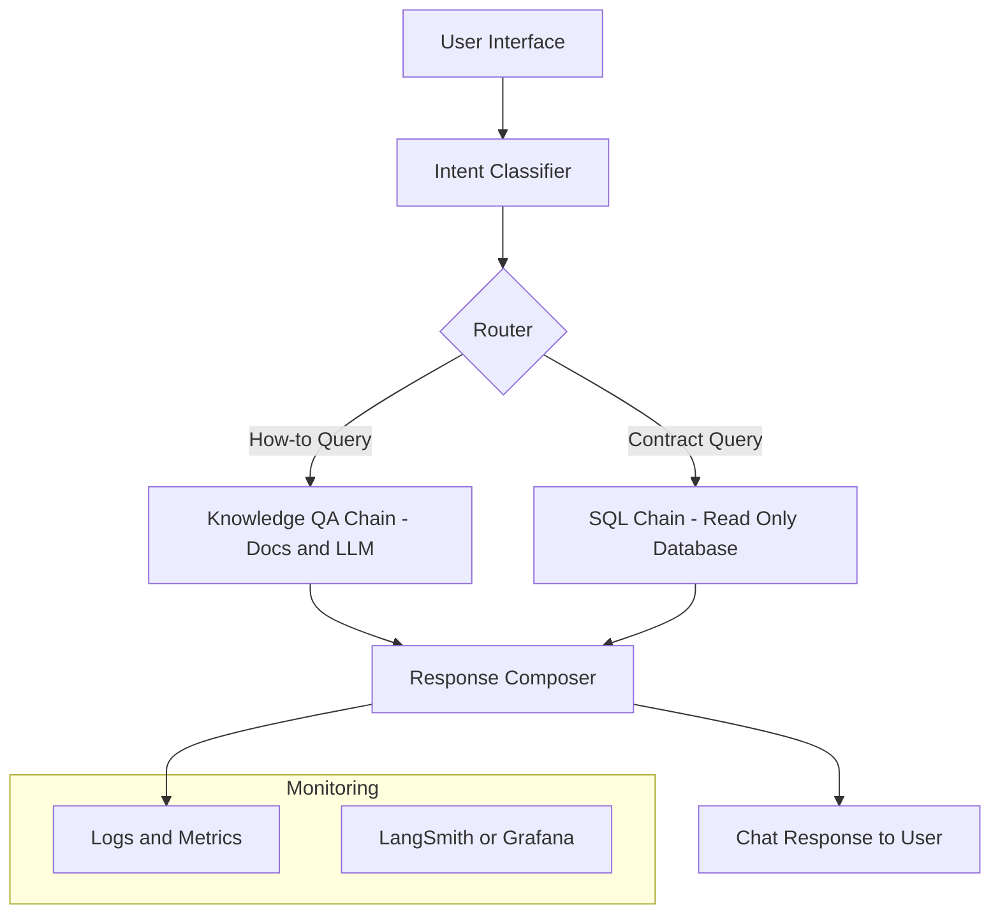
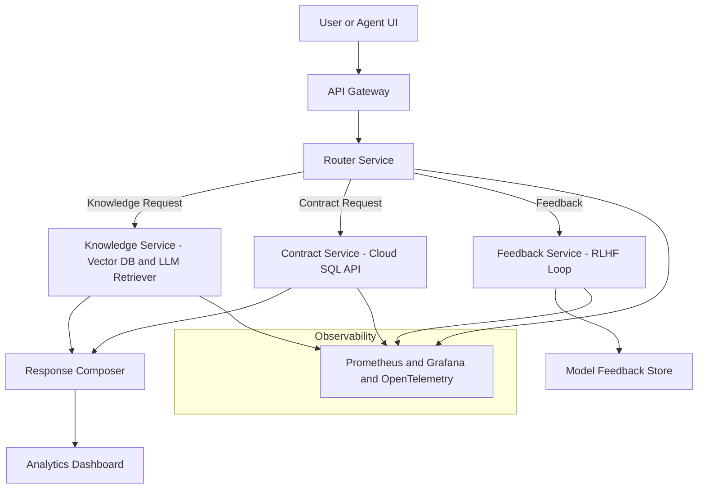

# Multi-Intent AI Chatbot Assistant

### Executive Summary
This solution equips service teams with a single AI assistant that can answer both **product questions** and **account-specific inquiries** with speed, accuracy, and compliance. 
 
It merges **retrieval-augmented generation** for documentation with **secure data access** for structured contract data.  

The design moves from a short proof-of-value pilot to a governed, enterprise-scale deployment using production-ready AI, data, and cloud services already common in analytics organizations.

---

## Phase 1 - Pilot Implementation (4–6 weeks)

**Purpose**  
Prove functional value, measure accuracy, and collect user feedback with minimal infrastructure.

**Core Stack (All Off-the-Shelf)**  
- FastAPI or Streamlit UI  
- Managed LLM API (OpenAI / Azure OpenAI / Anthropic)  
- LangChain or equivalent for RAG orchestration  
- Vector DB (FAISS / Pinecone) for documentation retrieval  
- Mock or read-only PostgreSQL for contract data  
- Docker container for deployment

**Deliverable**  
A working chatbot that:  
1. Detects user intent (“how-to” vs “contract”).  
2. Retrieves information from documents or SQL.  
3. Logs performance and feedback for analysis.

**Success Metrics**

| Objective | Metric | Target | Owner |
|------------|---------|---------|--------|
| Intent Classification | Accuracy | ≥ 80 % | Data Science |
| Response Quality | Human rating | ≥ 4 / 5 | CX Team |
| Latency | Avg response time | < 3 s | Engineering |
| Security | Data isolation audit | Pass | IT / Compliance |

**Outcome**  
Validated business case with measurable gains in agent efficiency and user satisfaction.

---

## Phase 2 - Enterprise Deployment (3–6 months)

**Purpose**  
Operationalize the pilot into a governed, observable, and continuously improving platform.

**Core Stack (Proven Enterprise Tech)**  
- Microservice architecture (FastAPI + Kubernetes / ECS)  
- Fine-tuned intent model (MiniLM / BERT-derived) with LLM fallback  
- Managed vector store and cloud SQL (Azure SQL / Snowflake)  
- Monitoring via Prometheus + Grafana, tracing via OpenTelemetry  
- CI/CD pipeline (GitHub Actions + Helm)  
- Governance + RBAC + PII filtering  
- Feedback loop for continuous learning (RLHF pipeline)

**Deliverable**  
A production system that scales across regions, integrates with internal data sources, and self-monitors for drift, cost, and reliability.

**Success Metrics**

| Objective | Metric | Target | Owner |
|------------|---------|---------|--------|
| Reliability | Uptime SLA | ≥ 99.9 % | DevOps |
| Performance | P95 latency | < 2 s | Engineering |
| Governance | Drift detection & audit | Automated | Data Ops |
| Cost Efficiency | Avg cost per query | <$ 0.05 | Finance |
| Continuous Learning | Model update cycle | Weekly | Data Science |

**Outcome**  
Enterprise-ready conversational analytics layer with full observability, governance, and cost control.

---

### Architecture Overview

#### Phase 1 - Pilot

#### Phase 2 - Production

---

### Implementation Confidence
- All components rely on **existing, production-proven cloud and AI tooling** - no custom research or untested frameworks.  
- Security and compliance use standard RBAC, logging, and data-access controls familiar to healthcare and analytics environments.  
- Each module can be delivered independently and integrated through APIs, allowing parallel workstreams and controlled rollout.  

---

### Contact
Developed by **James W. Niu**  
Questions: **jameswnarch@gmail.com**

---

### License
MIT License
