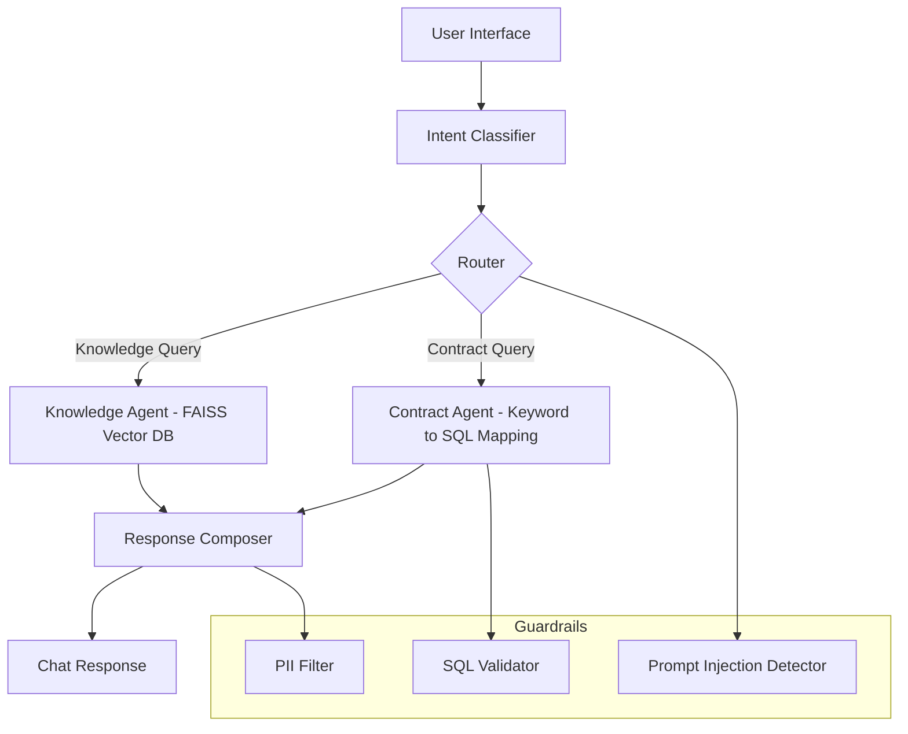

# Multi-Intent AI Chatbot Assistant

### Overview
The Multi-Intent AI Chatbot Assistant helps service and analytics teams answer both product-related and account-specific questions quickly, accurately, and securely.

The project evolves through three practical stages:

1. **Phase 1 - Pre-LLM (Deterministic Pilot)**  
   Offline, rule-based chatbot that uses FAISS for document search and keyword-to-SQL mapping.

2. **Phase 2 - Full LLM (Production)**  
   Retrieval-augmented generation (RAG) platform with microservices, continuous feedback, and observability.

3. **Phase 3 - Scaling and Orchestration (Kubernetes)**  
   Expands Phase 2 into a self-healing, auto-scaling, cloud-native platform.

---

## Phase 1 - Pre-LLM Pilot (4-6 weeks)

**Goal**  
Prove the concept with an explainable system that runs entirely offline.

**Core Stack**
- FastAPI backend  
- FAISS vector search with SentenceTransformers embeddings  
- Keyword-based SQL generation with guardrails  
- SQLite mock contract database  
- Docker for deployment and CI/CD

**What It Does**
1. Classifies intent (knowledge, contract, or unknown).  
2. Retrieves answers from local docs or SQL queries.  
3. Applies guardrails for SQL safety, PII protection, and prompt injection defense.  

**Key Metrics**

| Objective | Metric | Target | Owner |
|------------|---------|---------|--------|
| Intent Accuracy | ≥ 80 % | Data Science |
| Response Latency | < 3 s | Engineering |
| SQL Validation | 100 % Safe | Security |
| Positive Feedback | ≥ 70 % | CX Team |

**Outcome**  
A reliable, low-cost prototype that proves feasibility and governance readiness before introducing LLMs.

---

## Phase 2 - Full LLM Production (3-6 months)

**Goal**  
Scale the pilot into a production-grade platform that combines LLMs with retrieval and structured data.

**Core Stack**
- FastAPI microservices on Kubernetes or ECS  
- GPT-4 Turbo integrated with FAISS (RAG pattern)  
- Natural-language-to-SQL via LLM  
- RLHF feedback and retraining loop  
- Prometheus, Grafana, and OpenTelemetry for monitoring  
- Helm and multi-stage CI/CD pipelines  
- RBAC and security guardrails

**What It Adds**
- LLM-assisted intent classification in the Router Service  
- Contextual answers through RAG in Knowledge Service  
- LLM-generated SQL queries in Contract Service  
- Continuous learning via feedback loops  

**Key Metrics**

| Objective | Metric | Target | Owner |
|------------|---------|---------|--------|
| Reliability | Uptime ≥ 99.9 % | DevOps |
| Latency | P95 < 2 s (incl. LLM) | Engineering |
| Governance | Automated Drift Detection | Data Ops |
| Cost Efficiency | < $0.05 per query | Finance |
| Model Updates | Weekly Retraining | Data Science |

**Outcome**  
An enterprise-ready AI assistant that combines structured data, documentation, and natural conversation with transparency and traceability.

---

## Phase 3 - Scaling and Orchestration (6-12 months)

**Goal**  
Turn Phase 2 into a cloud-native, self-healing platform that scales automatically with demand.

**Core Stack Enhancements**
- Kubernetes (GKE, EKS, AKS) for orchestration  
- Helm for automated deployments  
- Horizontal Pod Autoscaler (HPA) for load scaling  
- Ingress and Load Balancer for global routing  
- GitOps (Argo CD or Flux) for continuous rollout  
- Unified observability with Prometheus and Grafana  

**What It Delivers**
1. Multi-node Kubernetes cluster with containerized services  
2. Rolling updates and zero-downtime deployments  
3. Centralized logs, metrics, and health monitoring  
4. Elastic scaling for varying workloads

**Key Metrics**

| Objective | Metric | Target | Owner |
|------------|---------|---------|--------|
| Horizontal Scaling | Pods expand under load in < 1 min | DevOps |
| Reliability | SLA ≥ 99.95 % | DevOps |
| Resource Efficiency | Node utilization ≥ 80 % | Finance |
| Deployment Speed | 100 % Zero-Downtime Rollouts | Platform Team |

**Outcome**  
A global, cloud-native chatbot platform that scales intelligently and recovers automatically — ready for enterprise traffic and future model integrations.

---

### Architecture Overview

#### Phase 1 - Pre-LLM Pilot


#### Phase 2 - LLM Production
```mermaid
flowchart TD
    A[User or Agent UI] --> B[API Gateway]
    B --> C[Router Service (LLM-assisted Intent Classification)]
    C -->|Knowledge Request| D[Knowledge Service (RAG with FAISS and LLM)]
    C -->|Contract Request| E[Contract Service (LLM for SQL Generation)]
    C -->|Feedback| F[Feedback Service (RLHF Loop)]
    D --> G[Response Composer]
    E --> G
    F --> H[Feedback Store]
    G --> I[Analytics Dashboard]

    subgraph Observability
        K[Prometheus, Grafana, OpenTelemetry]
    end
    C --> K
    D --> K
    E --> K
    F --> K
```

---

### Repository Structure
```
multi-intent-ai-chatbot-assistant/
├── phase1_pilot/
│   ├── app/
│   │   ├── main.py
│   │   ├── router.py
│   │   ├── intent_classifier.py
│   │   ├── chains.py
│   │   ├── contract_agent.py
│   │   └── utils.py
│   ├── guardrails/
│   │   ├── pii_filter.py
│   │   ├── sql_validator.py
│   │   └── prompt_injection_guard.py
│   ├── data/
│   │   ├── user_guide_sample.txt
│   │   └── mock_contracts.sql
│   ├── evals/
│   │   └── eval_results_phase1.md
│   ├── Dockerfile
│   └── ci_cd.yaml
│
├── phase2_production/
│   ├── services/
│   │   ├── router_service.py
│   │   ├── knowledge_service.py
│   │   ├── contract_service.py
│   │   ├── feedback_service.py
│   │   └── utils.py
│   ├── helm/
│   │   ├── deployment.yaml
│   │   └── secrets.yaml
│   ├── observability/
│   │   ├── prometheus_config.yml
│   │   └── grafana_dashboard.json
│   ├── evals/
│   │   └── eval_results_phase2.md
│   ├── .env.example
│   ├── Dockerfile
│   └── ci_cd_pipeline.yaml
│
└── phase3_scaling/
    ├── helm/
    │   ├── deployment.yaml
    │   └── values.yaml
    ├── observability/
    │   ├── prometheus_config.yml
    │   ├── grafana_dashboard.json
    │   └── alerts.yaml
    ├── gitops/
    │   └── argo_cd_pipeline.yaml
    ├── docs/
    │   └── phase3_scaling_overview.md
    └── README_phase3.md
```

---

### Contact
Developed by **James W. Niu**  
Questions: **jameswnarch@gmail.com**

---

### License
MIT License
